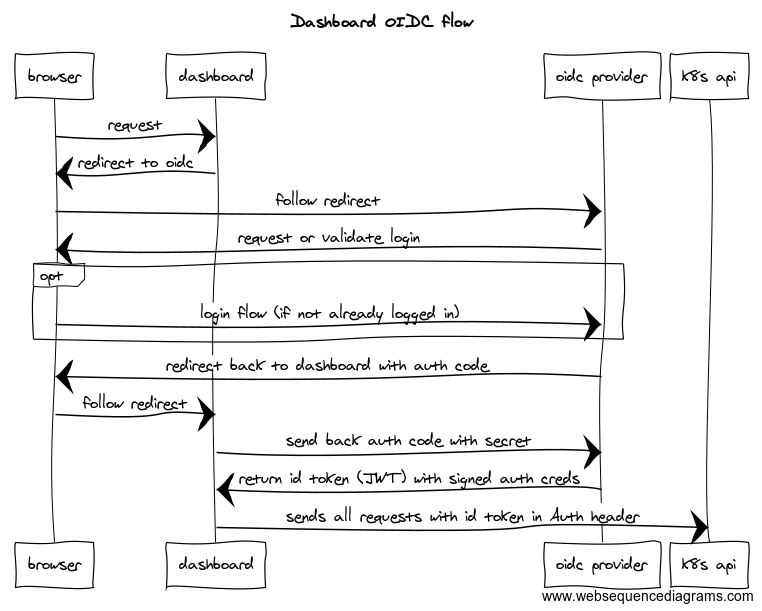
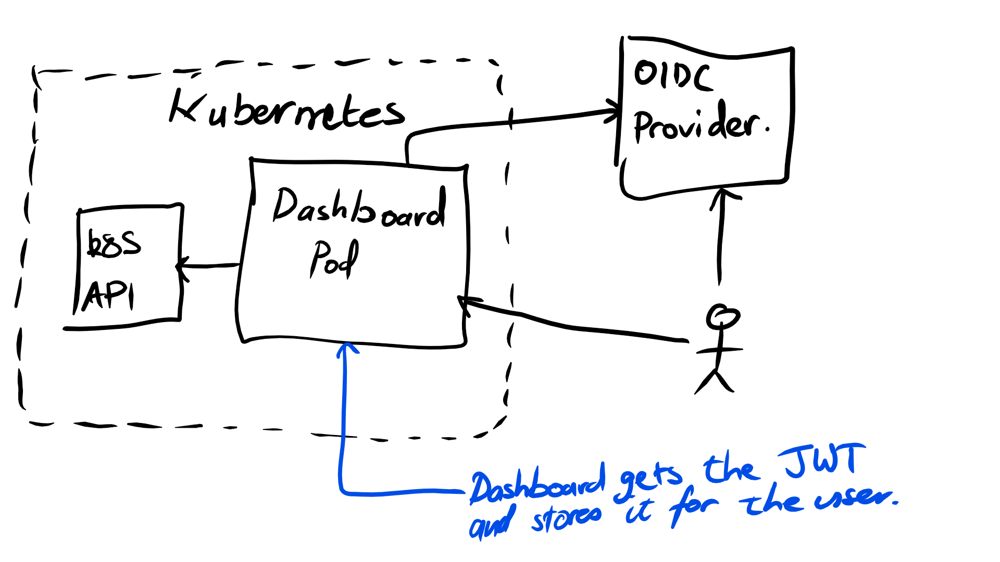
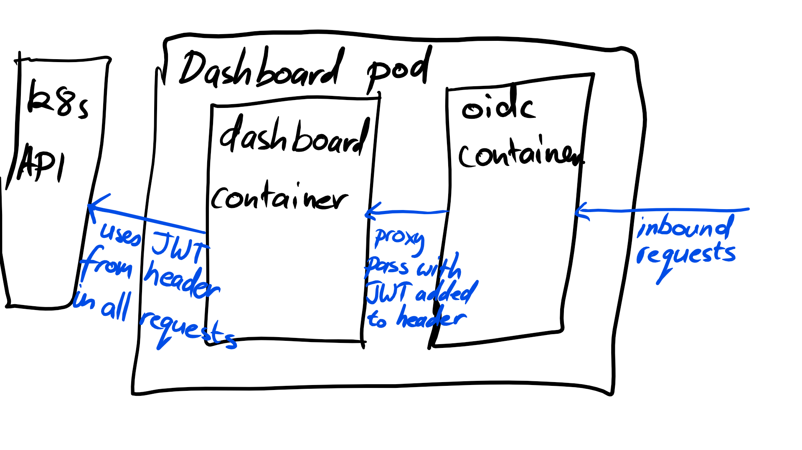

## Kubernetes Access Control

#### Connecting Kubernetes to your Identity Provider with OpenID Connect

https://github.com/pvdvreede/kubernetes-auth-presentation

Note:
* Presentation is on Github if you want to refer back later or copy anything from it

---

#### Why?

* We want to stop developers remembering yet another password
* We want operators to not have to manage another user management system
* We want to tie into our company's onboarding and offboarding procedures to give and revoke access without extra work

Note:
* Why would anyone want to bother doing this?
* It is some extra complexity to learn and understand upfront
* But there are benefits longer term
* However it does put a dependency on a third party system that k8s operators may or may not control

---

#### Potential providers

* Google
* Twitter
* Github
* Microsoft ADFS 2016
* Auth0
* Okta

Note:
* There are many solutions for integrating with
* Most possible IdPs that a Company may use would most likely be compatible
* Essentially anything that supports OpenID Connect will work

---

#### How does Kubernetes Auth/RBAC work?

```
kubectl / http client

  \/

authentication

  \/

authorization / RBAC

  \/

admission controllers
```

@[1]
@[2-5]
@[6-9]
@[10-13]

Note:
* Kubernetes API server uses a pipeline to determine whether an incoming request will succeed
* First checking the credentials to determine who a user is, either by:
  - hardcoded basic auth tokens
  - Client certificates
  - OIDC token (what we will look at today)
* If creds are validated and a userid is assigned we move onto seeing whether that user has the correct permissions to act on the resource that is the subject of the request - only if RBAC is enabled
* Finally if the user is allowed to perform an action on the resource admission controllers will determine any rules around the resource as to whether that type of resource supports the values the request is trying to set


---

#### Kubernetes RBAC (Authorization)

* Resources and Verbs
* Much like AWS IAM Policies
* Allows fine grain control over what a user or group has access over

Note:
* Just a quick mention of Kubernetes RBAC
* OIDC is integrated with RBAC in that you can specify the type of access a user has from your IDP, not just whether the user can access it at all
* It stands for Role Based Access Control
* It allows fine grained control over resources eg you can set only certain actions to be performed on specific resources
* It has gone GA since 1.8


---

#### What is OpenID Connect

* Allows delegating authentication of users to a trusted identity provider
* Decouples the login flow from the app via a signed Json Web Token (JWT)
* Sits on top of OAuth2 as an extension


Note:
* Dictates the claims being passed
* Has its own OAuth2 scope
* Provides introspection of the configuration via a `/.well-known/openidconfiguration` discovery endpoint
* The OAuth 2 spec specifies the auth flow and other things
* OpenID Connect just leverages that and standardises some of the claims present
* Important to note that k8s does not keep a user database - it merely sets the identity of a request via the OIDC token claim
* The well known endpoint contains uris, encryption keys so that they do not need to be specified by the client everytime and can be changed

---

#### How OIDC works



Note:
* Shows how the flow happens in the context of the k8s dashboard

---

#### The ID token

`eyJhbGciOiJSUzI1NiIsInR5cCI6IkpXVCJ9`.
`eyJzdWIiOiIxMjM0NTY3ODkwIiwibmFtZSI6IkpvaG4gRG9lIiwiYWRtaW4iOnRydWV9`.
`EkN-DOsnsuRjRO6BxXemmJDm3HbxrbRzXglbN2S4sOkopdU4IsDxTI8jO19W_A4K8ZPJijNLis4EZsHeY559a4DFOd50_OqgHGuERTqYZyuhtF39yxJPAjUESwxk2J5k_4zM3O-vtd1Ghyo4IbqKKSy6J9mTniYJPenn5-HIirE`

```
{
  "alg": "RS256",
  "typ": "JWT"
}
{
  "sub": "1234567890",
  "name": "John Doe",
  "admin": true
}
<signature of above>
```

Note:
* The key to OIDC and being able to decouple the login flow from the app is id_token that is given by the IdP and then used by the app
* The token itself is NOT encrypted
* It contains key, value pairs that anyone can see (ie claims)
* It also has a signature/checksum that anyone can use to verify the claims have not been tampered with

---

#### Demo



Note:
* We are going to do a demo where we use Auth0 and minikube to setup a local cluster with Open ID Connect authentication over the dashboard and for using with kubectl

---

#### Demo - Pod Dashboard setup



Note:
* Here is a zoomed in perspective of the kubernetes dashboard pod
* It differs in that the dashboard has a facade which is an openresty/nginx container in front that all requests are proxied through
* This openresty container is where the magic happens

---

# Demo

Note:
* Lets run through the demo
* Show Auth0 and we have a client setup
* Show our 'users' we have setup that are part of different groups
* So Auth0 is our IdP - we are delegating the authentication of users to it, and trusting it by accepting JWT that it has signed
* Make sure minikube start fresh with `minikube delete`
* Go through minikube setup and how we configure the api server with the oidc flags
* Create a new minikube cluster `01-minikube-up`
* Confirm our minikube ip with `minikube ip`
* So we have our cluster up and running and it is configured to accept oidc tokens from our IdP, how do we generate the tokens?
* We need to run the dashboard with our openresty container in front of it
* That container needs to know the client id and secret that we created in Auth0
* So we export our client details and then run `02-create-oidc-secrets`
* Now we deploy our dashboard pod with `03-deploy-dashboard`
* Note how the dashboard service account only has limited access
* If we go to the dashboard endpoint we should now get redirected to auth0 and be able to log in
* This will give us access to the dashboard! But the dashboard is telling us our user does not have access to anything :(
* If we look at the JWT we got back, you can see that one of the claims in there is `groups`, the api server during the authorization stage will try and match this list from the claims in the JWT to a role binding or cluster role binding in k8s.
* If we deploy some roles with `05-deploy-role-binding` refresh then things should start working
